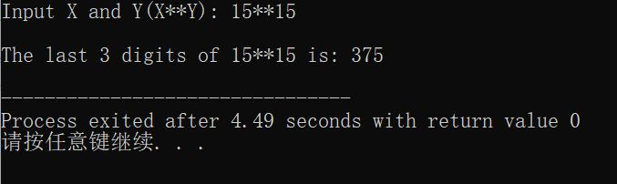
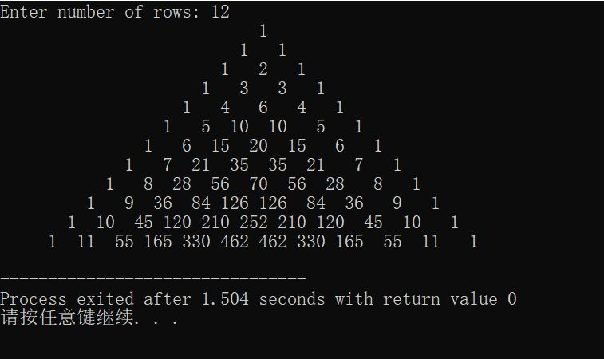

>有关变量类型的问题  

获取变量类型的方法：typeof x;  
```  
var x;  

document.write(typeof x);  
```  
注意在if语句里面，"1" == 1.因为JS会将它们两个的类型做一个隐式的转换，都会把它们转化成数字的1来进行作比较，这是if双等（即有两个等号）带来的问题
为了解决这个问题，if里面做条件判断的时候，经常还会用“全等”--->三个等号    
switch的比较是全等的比较，而不是像if那样是值的比较  
js的switch语句的使用跟c语言的差不多  
***= ：赋值；    
== ：仅判断值是否相等；    
===：全等，不仅值要相等，而已类型也要相等***  
>## 类型的转换  

系统提供的方法：用parseInt（）.它会把括号里面的内容转化成整数，通过它的转化，字符串就会变成数字了。  
>## 修改标签里面的内容  

***元素 = document.getElementById***  
***元素.innerHTML***
注意document.write是修改不了标签里面的内容的  
要先修改标签里面的内容首先得获取标签，然后再修改内容    
所以用document.geiElementById(" ")来获取标签，然后可以设置一个变量，例如：  
`
var my = document.getElementById("id的名称");
`  
这样的话这个变量就会对应相应的标签。  
然后用innerHTML来修改标签里面的内容。
这个innerHTML可以看成是一个变量，不过这个变量是放在my（自己在上面定义的元素）里面的，例如：  
`  
my.innerHTML = "***";
`  
这个innerHTML对应的是对应id的起始标签和结束标签之间的所有内容。  通过把具体的值赋值给my.innerHTML来改变   
> 打印星星  

```  
        <div id="mydiv">
            这是一个div
        </div>
            var my = document.getElementById("mydiv");
            console.log( my.innerHTML);
            my.innerHTML = "***";

            var allLine = "";//一个空字符串
            var floor = 5;
            for(var j = 0; j < floor; j++){
                var len = j+1;
                var oneLine = "";
                //oneline的作用是把字符串给拼起来
                for(var i = 0; i<len; i++){
                    oneLine += "*";
                    //每执行一次oneline都加上一个字符*
                }
                //document.write(oneline + "<br>");
                oneLine += "<br>";
                allLine += oneLine;
            }
            my.innerHTML = allLine;
```   
>## 有趣的循环编程  

**高次方数的尾数：求15的15次方的计算结果中最后三位数求解**  
问题分析与算法设计
解本题最直接的方法是：将15累乘15次方截取最后三位即可。
但是由于计算机所能表示的整数范围有限，用这种"正确"的算法不可能得到正确的结果。
事实上，题目仅要求最后三位的值，完全没有必要求15的15次方的完整结果。
研究乘法的规律发现：乘积的最后三位的值只与乘数和被乘数的后三位有关，与乘数和被乘数的高位无关。
利用这一规律，可以大大简化程序。
```
#include<stdio.h>

int main()
{
	int i,x,y,last=1;   
    /*变量last保存求X的Y次方过程中的部分乘积的后三位*/
	printf("Input X and Y(X**Y): ");
	scanf("%d**%d",&x,&y);
	for(i=1;i<=y;i++)  /*X自乘Y次*/
	{
		last=last*x%1000;  
        /*将last乘X后对1000取模，即求积的后三位*/
	 } 
	printf("\nThe last 3 digits of %d**%d is: %d\n",x,y,last%1000); /*打印结果*/
	return 0;
} 
```
  


**在不使用数组和光标的前提下打印漂亮的杨辉三角**  
```
#include <stdio.h>

int fun(int x)
{
    if(x ==1 || x ==0)
    {
        return 1;
    }
    else
    {
        return x*fun(x-1);
    }
}

int main()
{
    int rows, z = 1, k, i, j;

    printf("Enter number of rows: ");
    scanf("%d",&rows);

    for(i=0; i<rows; i++)
    {
        for(k=1; k <= rows-i; k++)
        {
             printf("  ");
        }   

        for(j=0; j <= i; j++)
        {       
           z = fun(i) / (fun(j)*fun(i-j));
            printf("%4d",z);
        }
        printf("\n");
    }

    return 0;
}
```
